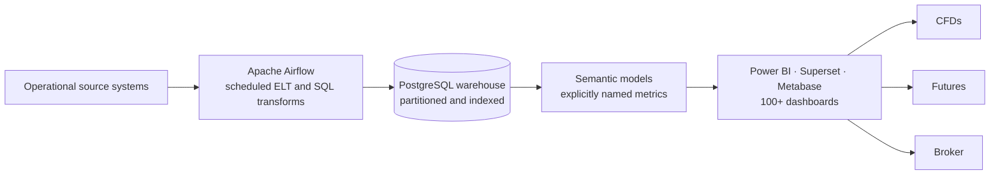
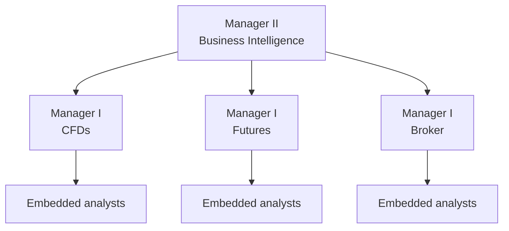

# Building a BI function from zero

**How a data function grew from one analyst to fifteen people across three business lines at a fast-growing prop trading firm — and what I would do differently.**

Kazi Nadimul Haque · Manager II, Business Intelligence, Next Ventures (FundedNext)

> 📖 **Easier to read on the portfolio:** [nadim-raj.github.io/building-bi-from-zero](https://nadim-raj.github.io/building-bi-from-zero/)
[Portfolio](https://nadim-raj.github.io) · [LinkedIn](https://www.linkedin.com/in/kazi-nadimul-haque/)

---

> **Scope of this write-up.** This is my own account. It deliberately contains no internal financial figures, no risk or fraud logic, no vendor costs or contract terms, and no names of colleagues. The numbers that do appear describe the team and the platform.

## At a glance

| | When I joined (2020) | Today |
|---|---|---|
| **Data team** | One analyst: me | 15 people across two management layers |
| **Warehouse** | None | PostgreSQL |
| **Pipelines** | Manual exports | Airflow-orchestrated ELT |
| **Reporting** | Spreadsheets passed between teams | 100+ dashboards on Power BI, Apache Superset, and Metabase |
| **Who it serves** | One company, no business-line split | CFDs, Futures, and Broker, each with embedded analysts |
| **Daily volume** | — | Tens of millions of rows |

## Contents

1. [The starting point](#1-the-starting-point)
2. [First build: what people use every day](#2-first-build-what-people-use-every-day)
3. [The warehouse decision that wasn't a decision](#3-the-warehouse-decision-that-wasnt-a-decision)
4. [2022: when volume broke the setup](#4-2022-when-volume-broke-the-setup)
5. [Growing the team with the business](#5-growing-the-team-with-the-business)
6. [One metric, three definitions](#6-one-metric-three-definitions)
7. [The model nobody used](#7-the-model-nobody-used)
8. [Demand will always exceed capacity](#8-demand-will-always-exceed-capacity)
9. [What I would do differently](#9-what-i-would-do-differently)

---

## 1. The starting point

In 2020, Next Ventures was running a different fintech business. FundedNext, the prop trading firm the company is now known for, came later.

There was no data function. No warehouse, no pipelines, no dashboards. When someone needed a number, it came from a manual export and travelled between teams as a spreadsheet. I joined as the first analyst, which in practice meant I was the data function.

## 2. First build: what people use every day

The first thing I built that people came to rely on was a set of operational daily reports — the numbers teams needed to run the day, rather than a strategic view for leadership.

Operational reports have a useful property for a first build: people look at them every day. When a number is wrong, someone notices within hours rather than at the end of a quarter, and every correction teaches you something about how the underlying data actually behaves. A first build that nobody checks can be wrong for months.

I made my first hire within the first year.

## 3. The warehouse decision that wasn't a decision

The warehouse is PostgreSQL today, and the honest reason is proximity. The source data already lived in relational databases, so Postgres meant almost no migration and no new tooling to learn. Nobody sat down and compared it against BigQuery or Snowflake.

It has held up. The platform processes tens of millions of rows a day, and what keeps analytical queries workable at that volume is disciplined partitioning and indexing on the large tables.

But "it worked out" is not the same as "it was the right call." Next time I would make this decision deliberately — with volume projections, query patterns, and cost in front of me — rather than letting the most convenient database grow into the role.

## 4. 2022: when volume broke the setup

FundedNext launched in 2022, and data volume jumped. The reporting I had built for the earlier business could not keep up.

That is the point where an ad hoc setup stops being a shortcut and becomes a liability. The platform the team runs today looks like this:

If I could replay 2022, I would already have had dedicated data engineering skills on the team before the volume arrived. More on that in [section 9](#9-what-i-would-do-differently).

## 5. Growing the team with the business

The team did not grow on a hiring plan. It grew with the business: as CFDs, Futures, and Broker became distinct lines with their own questions, each needed its own analysts.

The management layer followed the same logic. Managers came in when the business lines split, so today each line has a manager and analysts embedded directly alongside the people making decisions, rather than a central team working through a shared queue.

Fifteen people in total: three managers, four senior analysts, and eight analysts.

**Why embedded rather than central.** A central queue is good at keeping analysts busy. Embedding is good at getting decisions to change, because the analyst hears the question in context and knows what the answer will be used for. Those are different goals, and once the business could afford it, the second one mattered more.

## 6. One metric, three definitions

The hardest thing I have had to enforce was not technical. It was pass rate.

Pass rate — and the evaluation-to-funded conversion behind it — is one of the numbers a prop trading business watches most closely. It is also genuinely ambiguous. A trader can hold more than one account and make more than one attempt, so pass rate can reasonably be counted against attempts, accounts, or traders, and each gives a different answer. Each business line had settled on the version that suited its own questions.

The obvious fix is to pick one definition and make everyone use it. I did not do that, because each variant was answering a legitimate question. The real problem was never that three definitions existed. It was that three different numbers were all called "pass rate," so two dashboards could disagree and both be correct.

Instead, we kept the variants and named each one explicitly. The goal was simple: a label always means exactly one calculation, and anyone reading a dashboard can tell which question a number answers.

The SQL was the easy half. The agreement was the work.

With hindsight, I would have done this much earlier. Definitions are cheapest to settle before dashboards are built on top of them, and hardest to settle once teams have started quoting their own version.

## 7. The model nobody used

Not everything landed. The clearest example is a predictive model that was technically sound and went unused.

The problem was not accuracy, and it was not trust. By the time the model shipped, the business question it had been built to answer had moved on.

That is a particular risk in a company growing this fast. A question can be urgent one quarter and irrelevant the next, and a long build cycle can deliver the answer after its moment has passed. Two things I would do differently:

- **Confirm who will act on the output before building it** — a named team, and the decision they will make with it.
- **Re-check the question before finishing, not just before starting.** In a fast-moving business, questions have a shelf life.

## 8. Demand will always exceed capacity

The recurring problem through all of this was demand. There were always more requests than the team could absorb, and that did not go away as the team grew.

Two things helped:

- **Growing and specialising the team.** Adding people, and moving from generalists towards more specialised roles as headcount allowed.
- **Making prioritisation explicit.** Larger work runs through a roadmap I own as Product Owner, rather than being decided by whoever asked most recently.

The answer to demand is not heroics. It is a visible backlog, and the willingness to tell a stakeholder what their request costs and what it would displace.

## 9. What I would do differently

Starting again, I would:

1. **Define core metrics before building on them.** Settling pass rate after dashboards already existed was harder than it would have been at the start.
2. **Confirm who will act on an output before investing in it,** and re-check the question before shipping.
3. **Bring in data engineering skills sooner.** A volume jump like 2022 is exactly when dedicated pipeline and platform expertise pays for itself.
4. **Choose the warehouse deliberately.** PostgreSQL has held up, but it was chosen by proximity rather than by design.

---

**About the author.** Kazi Nadimul Haque leads Business Intelligence at Next Ventures (FundedNext), where he joined in 2020 as the first analyst. More at [nadim-raj.github.io](https://nadim-raj.github.io).
